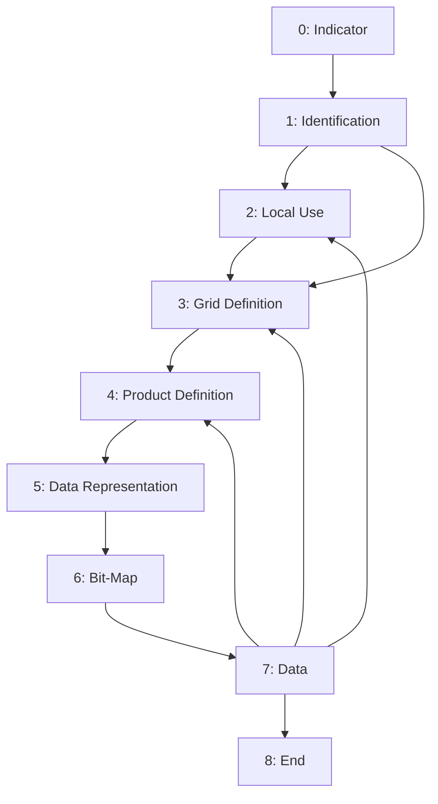

# tinygrib2

## GRIB2 Sections

https://codes.ecmwf.int/grib/format/grib2/overview/

## Code tables and templates

- GRIB2: https://github.com/wmo-im/grib2
  - ECMWF: https://codes.ecmwf.int/grib/format/grib2/
- CCT (Common Code Tables): https://github.com/wmo-im/CCT
